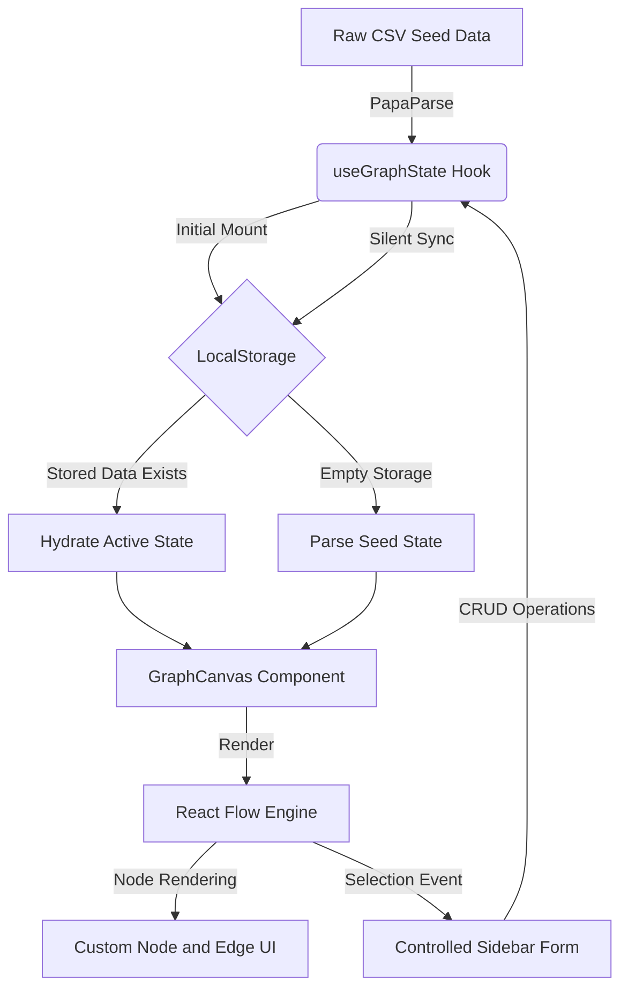

# Knowledge Base Graph Explorer

## Project Overview
A high-performance, interactive graph visualization application built with Next.js, React Flow, and Framer Motion. This tool transforms flat CSV seed data into an interconnected, manipulable web of knowledge. It is designed as a client-side single-page application (SPA) with full CRUD capabilities and persistent state management.

## Design System and User Experience
The application strictly adheres to a premium, iOS-inspired design language to ensure a high-fidelity user experience:
* **Glassmorphism and Translucency:** Utilizes deep background blurs (`backdrop-blur-3xl`) and translucent overlays to create depth without relying on heavy drop shadows.
* **Typography and Layout:** Built on the `-apple-system` font stack (San Francisco) with "Grouped Inset" form layouts native to modern Apple environments.
* **Fluid Motion:** Integrates Framer Motion for GPU-accelerated node entries, smooth sidebar transitions, and interactive scaling physics.
* **Focus Engine:** Implements a mathematical neighborhood-discovery algorithm. Clicking a node automatically dims unrelated entities (opacity routing), providing immediate cognitive focus on the active relationship tree.

## Technical Architecture
The codebase follows a decoupled logic pattern, strictly separating the rendering engine from the data management layer.

### System Data Flow



### Directory Structure and Responsibilities

| Directory | Core Responsibility |
| :--- | :--- |
| **/app** | Next.js App Router entry point. Configures global theme constants and locks viewport scrolling for the canvas engine. |
| **/components** | Visual presentation layer. Contains the interactive canvas, custom node/edge renderers, and the sliding sidebar. |
| **/hooks** | State management layer. Houses `useGraphState.ts`, which isolates data parsing, coordinate math, and `localStorage` syncing from the UI. |
| **/lib** | Static assets and utility files, including the raw CSV string payloads. |
| **/types** | Strict TypeScript interfaces (`AppNode`, `AppEdge`) to ensure type safety across data payloads and component props. |

## Core Technologies
* **Framework:** Next.js 15 (App Router, TypeScript)
* **Graph Engine:** React Flow
* **Animation and Motion:** Framer Motion
* **Styling:** Tailwind CSS v4
* **Data Parsing:** PapaParse
* **Icons:** Lucide React

## Local Development Setup

**1. Clone the repository**
```bash
git clone [https://github.com/puneetshukla041/assignment.git](https://github.com/puneetshukla041/assignment.git)
cd knowledge-graph-explorer
```

**2. Install dependencies**
```bash
npm install
```

**3. Start the development server**
```bash
npm run dev
```

**4. Build for Production**
```bash
npm run build
npm run start
```
*The application will be available at http://localhost:3000.*

## State Persistence
This application requires no backend. All state modifications (node positions, text updates, relationship connections, and deletions) are instantaneously synced to the browser's local storage via a custom React hook. Data will survive hard refreshes and tab closures.
